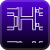
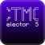
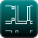
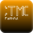
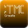

## Hi there, I'm Aeldit

I like programming all types of fun projects like Minecraft Mods / Resource Packs / Datapacks, Python and C games and C/C++ for Raspberry Pi PICO. Recently, I also started doing a lot of rust to learn it

| Languages I learned by myself | Languages I have been teached |
|:--:|:--:|
|         |     |

### On the applications side, I use (or have used) :

### Environnments I develop on :

| OS I use | OS I have used in the past |
|:--------:|:--------------------------:|
|  |   |

### Other miscellaneous software I use :

### My projects :

### My Minecraft projects on Modrinth :

### Stats

> [!NOTE]\
> The badges have been made by myself, using the template made by [integrav](https://github.com/intergrav/devins-badges).
>
> The logos either come from [Simple icons](https://simpleicons.org/) or
> from [Lucide](https://lucide.dev/icons/) (except the ones for my Minecraft projects, I made them myself; not the dark and smooth gui ones though)
>
> For the `simpleicons` logos, they are all under the `CC0 LICENSE` except:
> - JavaScript: [MIT](https://spdx.org/licenses/MIT)
> - Rust: [CC-BY-SA-4.0](https://spdx.org/licenses/CC-BY-SA-4.0)
> - Neovim and Git: [CC-BY-SA-3.0](https://spdx.org/licenses/CC-BY-SA-3.0)
> - IntelijIdea and PyCharm: [jetbrains](https://www.jetbrains.com/)
> - Raspberry PI: [raspberrypi](http://www.raspberrypi.com/)
> - Git: [CC-BY-3.0](https://spdx.org/licenses/CC-BY-3.0)
>
> For the `LUCIDE` logos, see https://lucide.dev/license.
>
> The last 3 "blocks" are using vercel.app
